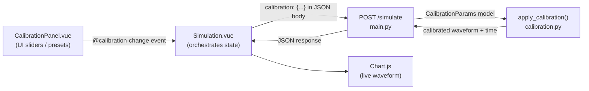

# Calibration System — Technical Report

## Overview

A complete calibration layer was added to the seismographic calculator to let users tune the simulated waveform output before and during simulation. The feature spans both the **FastAPI backend** and the **Vue.js frontend**, and is cleanly separated from the core simulation physics.

---

## Architecture



---

## Backend

### [calibration.py](file:///d:/Projects/seismographic-calculator/backend/calibration.py) — New file

All calibration logic lives in its own isolated module, keeping [main.py](file:///d:/Projects/seismographic-calculator/backend/main.py) clean.

#### [CalibrationParams](file:///d:/Projects/seismographic-calculator/backend/calibration.py#21-57) (Pydantic model)

| Field | Type | Range | Default | Effect |
|---|---|---|---|---|
| `amplitude_scale` | `float` | 0.1 – 5.0 | `1.0` | Multiplies the full waveform amplitude |
| `noise_level` | `float` | 0.0 – 1.0 | `0.03` | Fraction of peak amplitude used as noise σ |
| `sensor_sensitivity` | `float` | 0.1 – 5.0 | `1.0` | Additional gain layer on top of amplitude |
| `baseline_offset` | `float` | -2.0 – 2.0 | `0.0` | DC bias / constant shift added to waveform |
| `time_scale` | `float` | 0.1 – 5.0 | `1.0` | Stretches (>1) or compresses (<1) the time axis |

All fields are validated by Pydantic with [ge](file:///d:/Projects/seismographic-calculator/frontend/src/components/CalibrationPanel.vue#123-128)/`le` constraints and full docstrings.

#### [apply_calibration(waveform, time, params)](file:///d:/Projects/seismographic-calculator/backend/calibration.py#63-105) — 5-step pipeline

```python
# 1. Amplitude scaling
calibrated = waveform * params.amplitude_scale

# 2. Sensor sensitivity (second gain layer)
calibrated = calibrated * params.sensor_sensitivity

# 3. Noise overlay (fraction of peak amplitude)
peak = float(np.max(np.abs(calibrated))) or 1.0
calib_noise = np.random.normal(0, params.noise_level * peak, size=len(calibrated))
calibrated = calibrated + calib_noise

# 4. Baseline offset (DC shift)
calibrated = calibrated + params.baseline_offset

# 5. Time scaling
calibrated_time = time * params.time_scale
```

> **Design note:** The amplitude and sensitivity steps are intentionally separate so they can be changed independently — amplitude mirrors hardware gain while sensitivity mimics sensor electronics.

#### Preset Profiles

Four built-in profiles are defined as a plain `dict` in [calibration.py](file:///d:/Projects/seismographic-calculator/backend/calibration.py) and exported to the API:

| Preset | Amp Scale | Noise | Sensitivity | Baseline | Time Scale |
|---|---|---|---|---|---|
| **Default** | 1.0 | 0.03 | 1.0 | 0.0 | 1.0 |
| **Noisy Environment** | 1.0 | 0.35 | 0.8 | 0.1 | 1.0 |
| **High Sensitivity** | 2.5 | 0.01 | 3.0 | 0.0 | 1.0 |
| **Low Sensitivity** | 0.4 | 0.05 | 0.3 | 0.0 | 1.2 |

---

### [main.py](file:///d:/Projects/seismographic-calculator/backend/main.py) — Modified

Two changes were made:

**1. [EarthquakeInput](file:///d:/Projects/seismographic-calculator/backend/main.py#28-33) extended with an optional calibration field:**
```python
from calibration import CalibrationParams, apply_calibration, PRESETS

class EarthquakeInput(BaseModel):
    magnitude: float
    duration: float
    frequency: float
    calibration: Optional[CalibrationParams] = None   # ← new
```

**2. `/simulate` endpoint applies calibration after physics:**
```python
calib = data.calibration if data.calibration is not None else CalibrationParams()
calibrated_waveform, calibrated_time = apply_calibration(recorded, t, calib)
```
The response now returns the calibrated `waveform` and `time` arrays, plus the active [calibration](file:///d:/Projects/seismographic-calculator/backend/calibration.py#63-105) values echoed back.

**3. New read-only endpoint:**
```
GET /calibration/presets
```
Returns all preset profiles as JSON, enabling the frontend (or external tools) to fetch them dynamically.

---

## Frontend

### [CalibrationPanel.vue](file:///d:/Projects/seismographic-calculator/frontend/src/components/CalibrationPanel.vue) — New file

A self-contained Vue component using the **Composition API** (`<script setup>`).

#### Key responsibilities

| Concern | Implementation |
|---|---|
| State | `reactive(params)` object mirroring all 5 parameters |
| Presets | `PRESETS` dict matching backend; [applyPreset(key)](file:///d:/Projects/seismographic-calculator/frontend/src/components/CalibrationPanel.vue#129-139) bulk-sets params |
| Pending indicator | `pendingChanges` ref turns on an animated amber dot when any slider moves without **Apply** being clicked |
| Emit | [emit('calibration-change', { ...params })](file:///d:/Projects/seismographic-calculator/frontend/src/components/CalibrationPanel.vue#123-128) fired on Apply or preset switch |
| Reset | Calls [applyPreset('default')](file:///d:/Projects/seismographic-calculator/frontend/src/components/CalibrationPanel.vue#129-139) which restores factory values and emits |

#### Slider configuration (declarative)

Each slider is defined as a config object — no duplicated markup:
```js
const sliders = [
  { key: 'amplitude_scale', label: 'Amplitude Scale', unit: '×', min: 0.1, max: 5.0, step: 0.1 },
  { key: 'noise_level',     label: 'Noise Level',     unit: '',  min: 0.0, max: 1.0, step: 0.01 },
  // ...
];
```
The template loops over `sliders` with `v-for`, keeping the markup DRY.

#### UI sections
1. **Header** — icon + "Calibration Settings" title + blinking pending dot
2. **Preset Profile grid** — 2×2 button grid; active preset is highlighted
3. **Parameters** — one `v-slider` per param with live numeric readout
4. **Current Values** — compact table showing all five values at a glance
5. **Action row** — **Reset** (grey) + **Apply** (green gradient) buttons

---

### [Simulation.vue](file:///d:/Projects/seismographic-calculator/frontend/src/pages/Simulation.vue) — Modified

**State:**
```js
const calibration = reactive({
  amplitude_scale: 1.0, noise_level: 0.03,
  sensor_sensitivity: 1.0, baseline_offset: 0.0, time_scale: 1.0
});
```

**Integration:**
```vue
<!-- In the left sidebar card -->
<CalibrationPanel @calibration-change="onCalibrationChange" />
```

**Handler — immediate re-simulation on Apply:**
```js
const onCalibrationChange = (newParams) => {
  Object.assign(calibration, newParams);
  clearTimeout(debounceTimer);
  fetchSimulation();  // immediate, no debounce
};
```

**Watcher — live re-simulation on slider drag (400 ms debounce):**
```js
watch(
  [() => calibration.amplitude_scale, () => calibration.noise_level,
   () => calibration.sensor_sensitivity, () => calibration.baseline_offset,
   () => calibration.time_scale],
  () => { clearTimeout(debounceTimer); debounceTimer = setTimeout(fetchSimulation, 400); }
);
```

**API call includes calibration in the body:**
```js
body: JSON.stringify({
  magnitude: magnitude.value,
  frequency: frequency.value,
  duration: duration.value,
  calibration: { ...calibration },  // ← sent every time
})
```

---

## Data Flow Summary

```
User adjusts slider / picks preset
        ↓
CalibrationPanel emits 'calibration-change'
        ↓
Simulation.vue updates reactive `calibration` object
        ↓
fetchSimulation() POST /simulate  { ..., calibration: { ... } }
        ↓
FastAPI parses CalibrationParams (Pydantic validates ranges)
        ↓
Physics simulation runs (P/S/Surface waves + spring model)
        ↓
apply_calibration() post-processes waveform (5-step pipeline)
        ↓
Response: calibrated waveform[] + time[]
        ↓
Chart.js streams the new buffer through the live scrolling chart
```

---

## Separation of Concerns

| Layer | Responsibility | File |
|---|---|---|
| Physics simulation | P/S/Surface wave generation, spring-mass model | [main.py](file:///d:/Projects/seismographic-calculator/backend/main.py) |
| Calibration math | Post-processing pipeline, preset definitions | [calibration.py](file:///d:/Projects/seismographic-calculator/backend/calibration.py) |
| API contract | Request/response models, routing | [main.py](file:///d:/Projects/seismographic-calculator/backend/main.py) |
| UI controls | Sliders, presets, emit events | [CalibrationPanel.vue](file:///d:/Projects/seismographic-calculator/frontend/src/components/CalibrationPanel.vue) |
| Page orchestration | Watcher, debounce, API calls, chart | [Simulation.vue](file:///d:/Projects/seismographic-calculator/frontend/src/pages/Simulation.vue) |
